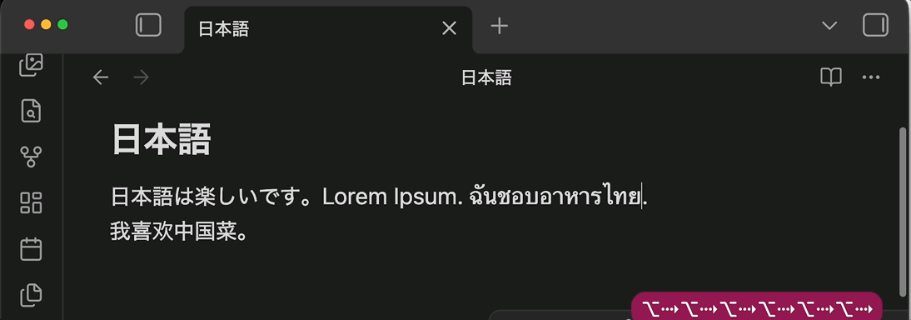

# Word Segmentation

Move, delete, and select **one word at a time** in languages that do not use spaces.

In Japanese, Chinese, Thai, and similar scripts, words run together. Obsidian’s default editor treats a whole sentence as one word. This plugin uses the browser’s built-in word segmenter so each word stands on its own.

## Demo

_word move, word delete, and double-click._

## Why you’ll like it

- Real words in **Japanese**, **Chinese**, **Thai**, **Lao**, **Khmer**, and **Burmese**
- Every word shortcut you already use: move, select, delete back, delete forward — **Option** on Mac, **Ctrl** on Windows and Linux
- **Double-click** (and **double-tap** on phone and tablet) selects one word
- Works with several cursors at once
- English and other space-separated languages behave exactly as before
- Zero setup: no settings, no downloads, fully offline, tiny

## Shortcuts

| Action               | macOS                                  | Windows / Linux                    |
| -------------------- | -------------------------------------- | ---------------------------------- |
| Move by word         | Option+Left / Option+Right             | Ctrl+Left / Ctrl+Right             |
| Select by word       | Option+Shift+Left / Option+Shift+Right | Ctrl+Shift+Left / Ctrl+Shift+Right |
| Delete previous word | Option+Backspace                       | Ctrl+Backspace                     |
| Delete next word     | Option+Delete                          | Ctrl+Delete                        |
| Select word          | Double-click or double-tap             | Double-click or double-tap         |

## Install

1. Open **Settings → Community plugins**
2. Select **Browse**, search for **Word Segmentation**
3. Install and enable

## License

MIT — see [LICENSE](LICENSE).

## Docs

- [Architecture](docs/architecture.md)
- [Contributing](docs/contributing.md)
- [Releasing](docs/releasing.md)
